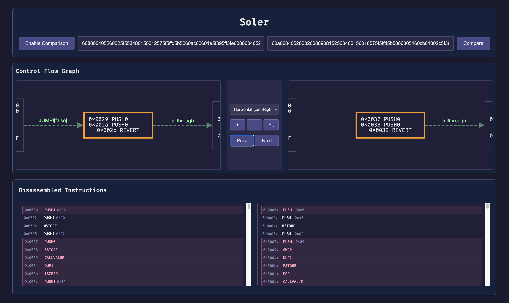

# Soler

A web application for disassembling Ethereum Virtual Machine (EVM) bytecode with a graphical user interface. Built with Python and JavaScript.



## Features

- Disassemble EVM bytecode into human-readable instructions
- Visualize control flow using an interactive graph
- Support for all EVM opcodes
- Modern, responsive user interface
- Cross-platform compatibility

## Prerequisites

- Python 3.8 or later
- Node.js (v16 or later)
- npm or yarn

## Installation

1. Clone the repository:
```bash
git clone https://github.com/yourusername/evm-disassembler.git
cd evm-disassembler
```

2. Install frontend dependencies:
```bash
npm install
```

3. Set up Python backend:
```bash
cd backend
python3 -m venv venv
source venv/bin/activate  # On Windows: venv\Scripts\activate
pip install -r requirements.txt
```

4. Start the application:
```bash
npm run start
```

This will start both the frontend (on http://localhost:3000) and backend (on http://localhost:8000) servers.

## Usage

1. Open your browser and navigate to http://localhost:3000
2. Enter EVM bytecode in the input field (with or without "0x" prefix)
3. Click "Disassemble" to process the bytecode
4. View the disassembled instructions and control flow graph

## Example

Input bytecode:
```
0x6080604052348015600f57600080fd5b5060005b600a57600a5b5b5b5b
```

Output:
```
0x00: PUSH1 0x80
0x02: PUSH1 0x40
0x04: MSTORE
0x0f: JUMPDEST
0x10: JUMP
```

## Development

The project structure:
```
soler/
├── backend/            # Python backend
│   ├── main.py        # FastAPI server
│   └── requirements.txt # Python dependencies
├── src/               # Frontend source
│   ├── index.html     # Main HTML file
│   ├── styles.css     # CSS styles
│   └── main.js        # JavaScript code
├── docs/              # Documentation assets
│   └── screenshot.png # Application screenshot
├── package.json       # Node.js dependencies
└── vite.config.js     # Vite configuration
```

## Documentation

### Adding Images to Documentation

You can enhance your documentation with images using Markdown syntax:

```markdown

```

For this project:
- Store documentation images in the `docs/` directory
- Use relative paths in markdown files
- Optimize images for web (compress PNGs, use appropriate dimensions)
- Consider adding multiple screenshots showing different features

Example of adding another image:
```markdown

```

## License

This project is licensed under the MIT License - see the LICENSE file for details. 